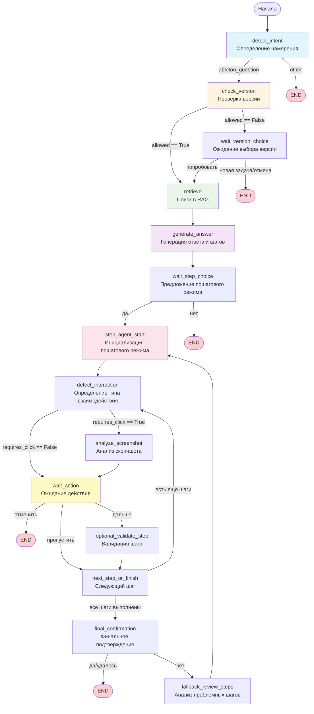

# Логика работы LangGraph агента

## Общее описание

LangGraph агент представляет собой state machine (машину состояний), которая обрабатывает пользовательские запросы о Ableton Live и предоставляет пошаговые инструкции. Агент использует RAG (Retrieval-Augmented Generation) для поиска релевантной документации и может работать в двух режимах: простом (simple) и пошаговом (step_by_step).

## Архитектура

### Основные компоненты

1. **State (Состояние)** - `AgentState` - хранит всю информацию о текущей сессии
2. **Nodes (Узлы)** - функции обработки, которые выполняют конкретные задачи
3. **Edges (Рёбра)** - условные переходы между узлами на основе состояния
4. **Workflow (Рабочий процесс)** - граф, определяющий последовательность выполнения узлов

## Схема потока выполнения

### Mermaid диаграмма



### ASCII схема

```
┌─────────────────────────────────────────────────────────────────────────┐
│                         НАЧАЛО: detect_intent                            │
│              Определение намерения пользователя                         │
│              (ableton_question / other)                                 │
└────────────────────────────┬────────────────────────────────────────────┘
                             │
                             ▼
                    ┌────────────────┐
                    │  ableton_question? │
                    └────────┬───────────┘
                             │
                ┌────────────┴────────────┐
                │                         │
                ▼                         ▼
         ┌─────────────┐          ┌──────────┐
         │ check_version│          │   END    │
         └──────┬───────┘          └──────────┘
                │
                ▼
        ┌───────────────────┐
        │  allowed == True?  │
        └───────┬───────────┘
                │
        ┌───────┴────────┐
        │                │
        ▼                ▼
┌──────────────┐  ┌──────────────────┐
│   retrieve   │  │wait_version_choice│
└──────┬───────┘  └────────┬──────────┘
       │                  │
       │                  ▼
       │          ┌──────────────────┐
       │          │  user_choice     │
       │          │  (попробовать/   │
       │          │   новая задача)  │
       │          └────────┬─────────┘
       │                   │
       │          ┌─────────┴─────────┐
       │          │                    │
       │          ▼                    ▼
       │    ┌──────────┐         ┌──────────┐
       │    │ retrieve │         │   END    │
       │    └────┬─────┘         └──────────┘
       │         │
       └─────────┘
                │
                ▼
        ┌──────────────────┐
        │ generate_answer  │
        │ Генерация ответа │
        │ и списка шагов   │
        └────────┬─────────┘
                 │
                 ▼
        ┌──────────────────┐
        │ wait_step_choice │
        │ Предложение      │
        │ пошагового режима│
        └────────┬─────────┘
                 │
        ┌────────┴────────┐
        │                 │
        ▼                 ▼
┌──────────────┐    ┌──────────┐
│ step_agent   │    │   END    │
└──────┬───────┘    └──────────┘
       │
       │
       ▼
┌──────────────────────┐
│ detect_interaction   │
│ Определение типа     │
│ взаимодействия       │
└──────────┬───────────┘
           │
    ┌──────┴──────┐
    │             │
    ▼             ▼
┌──────────┐  ┌──────────────┐
│analyze_  │  │ wait_action   │
│screenshot│  │ Ожидание     │
│          │  │ действия     │
└────┬─────┘  │ пользователя │
     │        └──────┬────────┘
     │              │
     └──────┬───────┘
            │
     ┌──────┴──────┐
     │             │
     ▼             ▼
┌──────────┐  ┌──────────┐
│ validate │  │next_step │
│          │  │          │
└────┬─────┘  └────┬─────┘
     │            │
     └─────┬──────┘
           │
     ┌─────┴─────┐
     │           │
     ▼           ▼
┌──────────┐ ┌──────────────────┐
│detect_   │ │final_confirmation │
│interaction│ │                  │
└────┬─────┘ └────────┬──────────┘
     │                │
     │        ┌───────┴───────┐
     │        │               │
     │        ▼               ▼
     │   ┌──────────┐   ┌──────────┐
     │   │   END    │   │ fallback │
     │   └──────────┘   └────┬─────┘
     │                      │
     │                      ▼
     │              ┌──────────────┐
     │              │ step_agent   │
     │              │ (повтор)     │
     │              └──────────────┘
     │
     └──────────────────────────────┘
              (цикл)
```

## Детальное описание узлов (Nodes)

### 1. `detect_intent`
**Назначение**: Определяет, относится ли запрос к Ableton Live или к чему-то другому.

**Логика**:
- Использует OpenAI API для классификации запроса
- Возвращает `"ableton_question"` или `"other"`
- Если API недоступен, по умолчанию считает запрос про Ableton

**Выход**: 
- Если `ableton_question` → `check_version`
- Если `other` → `END`

---

### 2. `check_version`
**Назначение**: Проверяет совместимость запроса с версией Ableton пользователя.

**Логика**:
- Создаёт embedding запроса
- Ищет релевантные чанки в `versions_index` (RAG)
- Использует LLM для анализа совместимости
- Устанавливает `allowed: true/false` и `version_explanation`

**Выход**:
- Если `allowed == False` → `wait_version_choice`
- Если `allowed == True` → `retrieve`

---

### 3. `wait_version_choice`
**Назначение**: Ожидает выбор пользователя, когда версия несовместима.

**Логика**:
- Устанавливает `action_required = "wait_version_choice"`
- Формирует сообщение с предупреждением и вариантами действий
- Ожидает ответ пользователя

**Выход**:
- Если пользователь выбрал "попробовать" → `retrieve`
- Если "новая задача" или "отмена" → `END`

---

### 4. `retrieve`
**Назначение**: Извлекает релевантные чанки документации из векторной базы.

**Логика**:
- Создаёт embedding запроса
- Ищет топ-K чанков в `full_index` (RAG)
- Сохраняет результаты в `selected_chunks`

**Выход**: Всегда → `generate_answer`

---

### 5. `generate_answer`
**Назначение**: Генерирует полный ответ и список пошаговых инструкций.

**Логика**:
- Использует найденные чанки как контекст
- Генерирует объяснение и JSON со списком шагов
- Каждый шаг имеет `text` и `requires_click: bool`
- Сохраняет `full_answer` и `steps`

**Выход**: Всегда → `wait_step_choice`

---

### 6. `wait_step_choice`
**Назначение**: Предлагает пользователю пошаговый режим.

**Логика**:
- Устанавливает `action_required = "wait_step_choice"`
- Показывает полный ответ и спрашивает, нужен ли пошаговый режим
- Если шагов нет, просто возвращает ответ

**Выход**:
- Если пользователь выбрал "да" → `step_agent`
- Если "нет" → `END`

---

### 7. `step_agent_start`
**Назначение**: Инициализирует пошаговый режим.

**Логика**:
- Устанавливает `mode = "step_by_step"`
- Устанавливает `current_step_index = 0`
- Показывает первый шаг

**Выход**: Всегда → `detect_interaction`

---

### 8. `detect_interaction`
**Назначение**: Определяет, требует ли текущий шаг клика по кнопке.

**Логика**:
- Анализирует текст текущего шага
- Использует LLM для определения `requires_click`
- Обновляет `steps[current_index]["requires_click"]`

**Выход**:
- Если `requires_click == True` → `analyze_screenshot`
- Если `requires_click == False` → `wait_action`

---

### 9. `analyze_screenshot`
**Назначение**: Анализирует скриншот для поиска координат кнопки.

**Логика**:
- Использует Vision API (GPT-4 Vision) для анализа скриншота
- Ищет элемент интерфейса, соответствующий инструкции шага
- Сохраняет координаты в `button_coords: {x, y, width, height}`

**Выход**: Всегда → `wait_action`

---

### 10. `wait_user_action`
**Назначение**: Ожидает действия пользователя (дальше, пропустить, отменить).

**Логика**:
- Устанавливает `action_required = "wait_user_action"`
- Показывает текущий шаг и координаты кнопки (если есть)
- Ожидает выбор пользователя

**Выход**:
- Если "отменить" → `END`
- Если "пропустить" → `next_step`
- Если "дальше" → `validate`

---

### 11. `optional_validate_step`
**Назначение**: Опционально валидирует выполнение шага.

**Логика**:
- Работает только для шагов с `requires_click == True`
- Использует Vision API для проверки скриншота после действия
- Определяет, был ли шаг выполнен корректно
- Если нет - показывает предупреждение

**Выход**: Всегда → `next_step`

---

### 12. `next_step_or_finish`
**Назначение**: Переходит к следующему шагу или завершает процесс.

**Логика**:
- Увеличивает `current_step_index`
- Если есть ещё шаги → продолжает
- Если шаги закончились → переходит к финальному подтверждению

**Выход**:
- Если есть ещё шаги → `detect_interaction` (цикл)
- Если шаги закончились → `final_confirmation`

---

### 13. `final_confirmation`
**Назначение**: Финальное подтверждение успешности выполнения задачи.

**Логика**:
- Спрашивает пользователя, удалось ли решить задачу
- Ожидает ответ "да/нет"

**Выход**:
- Если "да" → `END`
- Если "нет" → `fallback`

---

### 14. `fallback_review_steps`
**Назначение**: Анализирует шаги, чтобы найти проблемные.

**Логика**:
- Использует LLM для анализа всех шагов
- Определяет, какие шаги могли быть выполнены неправильно
- Возвращается к первому проблемному шагу

**Выход**: Всегда → `step_agent` (повтор с проблемного шага)

## Состояние (AgentState)

```python
AgentState = {
    # Базовая информация
    session_id: str
    user_query: str
    ableton_edition: str
    conversation_history: List[Dict]
    screenshot_url: Optional[str]
    
    # Определение намерения
    intent: Optional["ableton_question" | "other"]
    
    # Проверка версии
    allowed: Optional[bool]
    version_explanation: Optional[str]
    
    # RAG
    selected_chunks: List[Dict]
    
    # Генерация ответа
    full_answer: Optional[str]
    steps: List[Dict]  # [{text, requires_click, button_coords}]
    
    # Пошаговый режим
    mode: "simple" | "step_by_step"
    current_step_index: int
    user_choice: Optional[str]
    
    # Управление действиями
    action_required: Optional[
        "wait_version_choice" | 
        "wait_step_choice" | 
        "wait_user_action"
    ]
    
    # Ответ пользователю
    response_text: Optional[str]
}
```

## Условные переходы (Conditional Edges)

### 1. `should_continue_after_intent`
- Если `intent == "ableton_question"` → `check_version`
- Иначе → `END`

### 2. `should_continue_after_version_check`
- Если `allowed == False` → `wait_version_choice`
- Иначе → `retrieve`

### 3. `should_continue_after_version_choice`
- Если пользователь выбрал "новая задача" или "отмена" → `END`
- Иначе → `retrieve`

### 4. `should_continue_after_step_choice`
- Если пользователь выбрал "да" → `step_agent`
- Иначе → `END`

### 5. `should_continue_after_interaction_type`
- Если `steps[current_index].requires_click == True` → `analyze_screenshot`
- Иначе → `wait_action`

### 6. `should_continue_after_user_action`
- Если "отменить" → `END`
- Если "пропустить" → `next_step`
- Иначе → `validate`

### 7. `should_continue_after_next_step`
- Если `current_step_index < len(steps)` → `detect_interaction`
- Иначе → `final_confirmation`

### 8. `should_continue_after_final_confirmation`
- Если "да" или "удалось" → `END`
- Иначе → `fallback`

## RAG (Retrieval-Augmented Generation)

### Структура данных

1. **full_index** - основной индекс документации Ableton Live 12
   - Загружается из `live12-manual-chunks-with-embeddings.json`
   - Используется для поиска релевантной информации

2. **versions_index** - индекс различий между версиями
   - Загружается из `Ableton-versions-diff-chunks-with-embeddings.json`
   - Используется для проверки совместимости версий

### Процесс поиска

1. Создание embedding запроса через OpenAI API (`text-embedding-3-large`)
2. Поиск топ-K чанков по косинусному сходству
3. Фильтрация по edition (если указано)
4. Возврат релевантных чанков с метаданными

## API Endpoints

### POST `/chat`
Основной endpoint для обработки сообщений пользователя.

**Вход**:
- `message`: текст запроса
- `session_id`: ID сессии (опционально)
- `history`: история разговора
- `ableton_edition`: версия Ableton
- `screenshot_url`: URL скриншота (опционально)

**Выход**:
- `response`: текст ответа
- `session_id`: ID сессии
- `mode`: режим работы
- `steps`: список шагов (если пошаговый режим)
- `action_required`: требуемое действие

**Логика**:
- Создаёт или обновляет сессию
- Запускает workflow до достижения `action_required` или `END`
- Возвращает результат

### POST `/step`
Обработка действий в пошаговом режиме.

**Вход**:
- `session_id`: ID сессии
- `user_action`: действие пользователя ("next", "skip", "cancel")
- `screenshot_url`: URL скриншота (опционально)

**Выход**:
- Информация о следующем шаге или завершении

### POST `/step/validate`
Валидация выполнения шага.

**Вход**:
- `session_id`: ID сессии
- `screenshot_url`: URL скриншота после действия
- `step_index`: индекс шага

**Выход**:
- `valid`: результат валидации
- `explanation`: объяснение (если невалидно)

## Особенности реализации

### Обработка сессий
- Сессии хранятся в памяти (`sessions: dict`)
- Каждая сессия сохраняет полное состояние
- При новом запросе состояние обновляется и workflow продолжается

### Обработка user_choice
- Когда workflow останавливается на `action_required`, следующий запрос интерпретируется как `user_choice`
- `user_query` не обновляется, если это ответ на `wait_step_choice` или `wait_version_choice`

### Циклы в workflow
- Пошаговый режим создаёт цикл: `detect_interaction` → `wait_action` → `validate` → `next_step` → `detect_interaction`
- Цикл прерывается, когда `current_step_index >= len(steps)`

### Fallback механизм
- Если задача не решена, `fallback` анализирует шаги и возвращается к проблемному шагу
- Это создаёт возможность повторной попытки выполнения

## Примеры потоков

### Простой запрос (без пошагового режима)
```
detect_intent → check_version → retrieve → generate_answer → wait_step_choice → END
```

### Запрос с несовместимой версией
```
detect_intent → check_version → wait_version_choice → (пользователь выбирает) → retrieve → ... → END
```

### Полный пошаговый режим
```
detect_intent → check_version → retrieve → generate_answer → wait_step_choice → step_agent → 
detect_interaction → analyze_screenshot → wait_action → validate → next_step → 
detect_interaction → wait_action → validate → next_step → ... → 
final_confirmation → END
```

### С fallback
```
... → final_confirmation → fallback → step_agent → (повтор с проблемного шага) → ...
```

